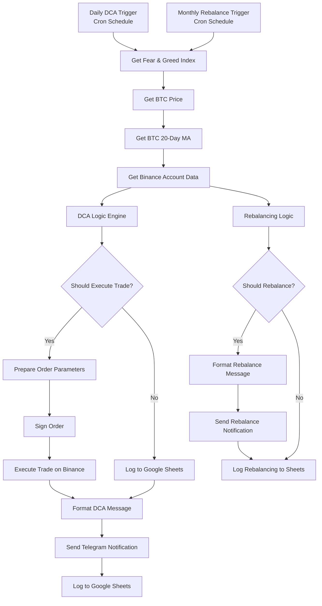

# Crypto DCA System Architecture

## 🏗️ System Overview

This automated crypto DCA system implements a sophisticated strategy that combines sentiment-driven DCA with dynamic portfolio management. The architecture is built on n8n workflow automation with multiple external integrations and embedded risk management.

## 📊 Architecture Components

### Core Infrastructure
```
┌─────────────────┐    ┌─────────────────┐    ┌─────────────────┐
│   Docker Host   │    │   PostgreSQL    │    │      n8n        │
│                 │◄──►│   Database      │◄──►│   Orchestrator  │
│   Ubuntu/MacOS  │    │   (Workflow     │    │   (Workflows)   │
│                 │    │    History)     │    │                 │
└─────────────────┘    └─────────────────┘    └─────────────────┘
```

### External Integrations
```
┌─────────────────┐    ┌─────────────────┐    ┌─────────────────┐
│ Fear & Greed    │    │   Binance API   │    │ Google Sheets   │
│ Index API       │    │  (DCA &     │    │   (Logging)     │
│ (Sentiment)     │    │   Portfolio)    │    │                 │
└─────────────────┘    └─────────────────┘    └─────────────────┘
         │                       │                       │
         └───────────────────────┼───────────────────────┘
                                 │
                    ┌─────────────────┐
                    │   Telegram Bot  │
                    │ (Notifications) │
                    └─────────────────┘
```

## 🔄 Workflow Architecture

### 1. Daily DCA Workflow
**Triggers**: Both daily and monthly cron triggers feed into the same workflow
**Purpose**: Execute sentiment-driven DCA on satellite portfolio (daily) or rebalancing (monthly)



### 2. Unified Data Processing
**All triggers share the same data processing pipeline**:
- Fear & Greed Index retrieval
- BTC price and 20-day MA calculation
- Portfolio balance fetching
- Parallel execution of DCA and rebalancing logic

## 🧠 DCA Logic Details

### Daily Sentiment-Based DCA Rules
The system uses the Fear & Greed Index to determine market sentiment and adjust satellite DCA behavior:

| Index Range | Sentiment | Action | Satellite Pool % | Rationale |
|------------|-----------|---------|------------------|-----------|
| 0-20 | Extreme Fear | Buy Aggressive | 7.5% | Maximum opportunity |
| 21-30 | Fear | Buy Moderate | 4% | Good buying opportunity |
| 31-60 | Neutral | DCA Conditional | 1% | Only if BTC < MA20 |
| 61-70 | Greed | Sell Small | 4% | Take some profits |
| 71-80 | High Greed | Sell Moderate | 7.5% | Market likely overvalued |
| 81-100 | Extreme Greed | Sell Aggressive | 10% | Maximum profit taking |

### Monthly Rebalancing - Dynamic Target Allocation
The system adjusts the core portfolio target allocation based on Fear & Greed Index:

| Index Range | Sentiment | Target BTC % | Strategy |
|-------------|-----------|--------------|----------|
| 0-20 | Extreme Fear | 85% | Accumulate Aggressively |
| 21-30 | Fear | 80% | Accumulate More |
| 31-60 | Neutral | 75% | Base Allocation |
| 61-70 | Greed | 70% | Take Some Profits |
| 71-80 | High Greed | 65% | Take More Profits |
| 81-100 | Extreme Greed | 60% | Maximum Profit Taking |

**Key Features**:
- Rebalancing only executes on the 1st day of the month
- ±5% rebalancing band prevents unnecessary trades
- Separate logging for rebalancing activities

### Portfolio Structure

#### Core Portfolio (90% of total capital)
- **Dynamic Allocation**: 60-85% BTC based on Fear & Greed Index
- **Rebalancing Band**: ±5% (triggers at deviation from target)
- **Strategy**: Buy-and-hold with monthly rebalancing
- **Trade Type**: Limit orders to minimize slippage

#### Satellite Portfolio (30% of total capital)
- **Purpose**: Daily active DCA based on sentiment
- **Strategy**: Fear & Greed Index driven
- **Risk Level**: Higher frequency, smaller position sizes
- **Trade Type**: Limit orders with 1% slippage tolerance

## 🛡️ Risk Management Framework

### Embedded Risk Configuration
All risk parameters are embedded directly in the workflow nodes:

```javascript
RISK_CONFIG = {
  PORTFOLIO: {
    TARGET_BTC_ALLOCATION: 0.75,     // Base 75% BTC target (dynamic)
    REBALANCE_BAND: 0.05,            // ±5% rebalancing threshold
    SATELLITE_POOL_PERCENTAGE: 0.3,  // 30% for active DCA
  },
  TRADING: {
    MAX_TRADES_PER_WEEK: 3,          // Maximum satellite trades per week
    SLIPPAGE_TOLERANCE: 0.01,        // 1% maximum slippage
    MIN_BTC_BALANCE: 0.01,           // Minimum BTC to maintain
    MIN_EUR_BALANCE: 100,            // Minimum EUR to maintain
  },
  CIRCUIT_BREAKERS: {
    MAX_PORTFOLIO_DECLINE_7D: -0.20, // Stop if portfolio down >20% in 7 days
    MAX_BTC_DECLINE_24H: -0.10,      // Stop if BTC down >10% in 24 hours
  }
}
```

### Circuit Breakers
1. **Portfolio Protection**: Stop DCA if portfolio declines >20% in 7 days
2. **Volatility Protection**: Stop DCA if BTC declines >10% in 24 hours
3. **Liquidity Protection**: Maintain minimum balances (0.01 BTC, 100 EUR)
4. **Frequency Control**: Maximum 3 satellite trades per week, monthly rebalancing only

### Security Measures
- HMAC SHA256 signature generation for all Binance API calls
- Environment variable storage for sensitive data
- Comprehensive error handling and logging
- Built-in retry mechanisms with exponential backoff

## 📈 Data Flow Architecture

### Node-by-Node Data Flow

#### 1. Data Collection Nodes
```
Daily/Monthly Trigger → Get Fear & Greed Index → Get BTC Price → Get BTC 20-Day MA → Get Binance Account Data
```

#### 2. Logic Processing Nodes
```
DCA Logic Engine (Daily)     ┐
                                ├─ Parallel Execution
Rebalancing Logic (Monthly)     ┘
```

#### 3. Execution Branches
```
DCA Path:
Should Execute Trade? → Prepare Order Parameters → Sign Order → Execute Trade on Binance

Rebalancing Path:  
Should Rebalance? → Format Rebalance Message → Send Rebalance Notification

Both Paths Converge:
Format DCA Message → Send Telegram Notification → Log to Google Sheets
```

### Input Data Sources
```
Fear & Greed Index API
├── Endpoint: https://api.alternative.me/fng/
├── Frequency: Called for both daily and monthly triggers
├── Data: Sentiment score (0-100) + classification
└── Retry Logic: 3 attempts with 1 second intervals

Binance API  
├── Price Data: /api/v3/ticker/price?symbol=BTCEUR
├── Historical Data: /api/v3/klines (20-day MA calculation)
├── Account Data: /api/v3/account (authenticated)
├── DCA: /api/v3/order (authenticated)
└── Authentication: HMAC SHA256 with environment variables

Portfolio Calculations
├── BTC Balance (free amount from Binance)
├── EUR Balance (free amount from Binance)  
├── Total Portfolio Value (BTC × price + EUR)
├── Current Allocations (percentages)
└── Satellite Pool (30% of total value)
```

### Output Data Streams
```
Google Sheets Logging (Two Sheets)
├── DCA Log (Sheet ID: 0)
│   ├── All daily DCA activities and decisions
│   ├── Trade execution results and errors  
│   └── Portfolio metrics and performance tracking
└── Rebalancing Log (Sheet ID: 352730297)
    ├── Monthly rebalancing decisions and execution
    ├── Fear & Greed Index strategy adjustments
    └── Portfolio allocation changes

Telegram Notifications
├── Daily trade summaries (success/failure/hold)
├── Monthly rebalancing alerts with strategy explanation
├── Error notifications with detailed context
└── Formatted messages with portfolio metrics

Binance Orders
├── Limit orders for all trades (1% slippage tolerance)
├── HMAC SHA256 signature authentication
├── Real-time execution with error handling
└── Order status tracking and logging
```

## ⚡ Performance Optimization

### Efficient Workflow Design
- **Parallel Logic Execution**: DCA and rebalancing logic run simultaneously
- **Single Data Pipeline**: All triggers share the same data collection nodes
- **Embedded Configuration**: No external file dependencies
- **Optimized API Calls**: Minimal requests with comprehensive error handling

### Resource Management
- **Memory Efficient**: Stateful workflow data for tracking historical values
- **Network Optimized**: Request retry logic with proper timeouts (10 seconds)
- **Database Light**: PostgreSQL only for n8n workflow state
- **CPU Efficient**: JavaScript-based calculations in Code nodes

## 🔍 Monitoring & Observability

### Comprehensive Logging
Every action is logged with detailed context:
- **DCA Decisions**: Fear & Greed Index, calculated DCA sizes, rationale
- **Rebalancing Decisions**: Current vs target allocations, trade amounts
- **Execution Results**: Order IDs, executed quantities, error messages
- **System Health**: API response times, error frequencies

### Error Handling Strategy
```
API Call Failures
├── Automatic retry (3 attempts)
├── Exponential backoff
├── Telegram error notifications
├── Graceful degradation
└── Comprehensive error logging

DCA Execution Errors
├── Circuit breaker activation
├── Position preservation
├── Error message to Telegram
├── Google Sheets error logging
└── System state preservation
```

### Real-Time Monitoring
- **Telegram Notifications**: Immediate alerts for all significant events
- **Google Sheets**: Historical performance tracking and analysis
- **n8n Execution Logs**: Detailed workflow execution history
- **Error Tracking**: Categorized error reporting and analysis

## 🚀 Deployment Architecture

### Container-Based Deployment
```
Docker Composition
├── PostgreSQL Database
│   ├── Persistent workflow state
│   ├── Execution history
│   └── Configuration storage
└── n8n Application
    ├── Workflow orchestration
    ├── API integrations
    ├── Authentication management
    └── Scheduled execution
```

### Environment Configuration
```
Required Environment Variables
├── BINANCE_API_KEY (DCA authentication)
├── BINANCE_SECRET_KEY (signature generation)  
├── TELEGRAM_CHAT_ID (notification target)
└── N8N_ENCRYPTION_KEY (credential security)

OAuth2 Credentials (managed in n8n)
├── Google Sheets API (logging)
└── Telegram Bot API (notifications)
```

## 📱 Integration Architecture

### External Service Dependencies
1. **Fear & Greed Index API**
   - **Availability**: 99%+ uptime expected
   - **Rate Limits**: Generally unrestricted
   - **Fallback**: Previous day's value or manual intervention

2. **Binance Spot API**
   - **Rate Limits**: 1200 requests/minute (weight-based)
   - **Authentication**: HMAC SHA256 signatures
   - **Endpoints Used**: Price data, historical data, account info, order placement

3. **Google Sheets API**
   - **Rate Limits**: 100 requests/100 seconds per user
   - **Authentication**: OAuth2 with automatic token refresh
   - **Usage**: Dual-sheet logging system

4. **Telegram Bot API**
   - **Rate Limits**: 30 messages/second
   - **Reliability**: Very high (>99.9% uptime)
   - **Usage**: Real-time notifications and error alerts

## 🔧 Configuration Management

### Embedded Configuration Strategy
All configuration is embedded within the workflow Code nodes:
- **Risk Parameters**: Directly in RISK_CONFIG objects
- **API Endpoints**: Hardcoded in HTTP Request nodes
- **Sheet Structure**: Defined in Google Sheets nodes
- **Message Formatting**: Embedded in formatting Code nodes

### Advantages of Embedded Configuration
- **Portability**: Single JSON file contains complete system
- **Version Control**: Configuration changes tracked with workflow
- **No Dependencies**: No external configuration files needed
- **Consistency**: Configuration always matches implementation

## 📋 Maintenance Procedures

### Automated System Health
- **Self-Monitoring**: Built-in error detection and reporting
- **Circuit Breakers**: Automatic DCA suspension on risk triggers
- **Graceful Degradation**: System continues with reduced functionality
- **State Preservation**: Workflow maintains critical data between executions

### Manual Maintenance Requirements
- **Monthly Review**: Performance analysis and parameter adjustment
- **Quarterly Security**: API key rotation and security audit
- **Semi-Annual Optimization**: Strategy effectiveness review
- **Annual Architecture**: System architecture and scaling review

This architecture provides a robust, self-contained automated DCA system with comprehensive risk management, monitoring, and error handling capabilities while maintaining simplicity in deployment and maintenance. 